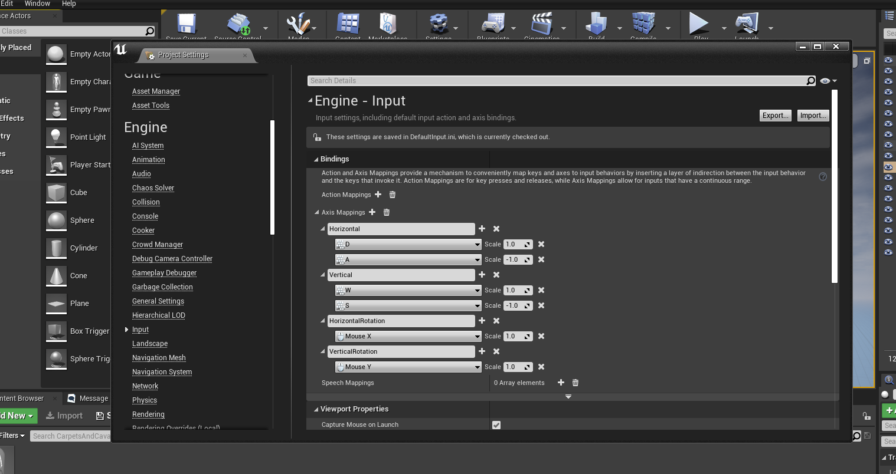

# CarpetsAndCavalry

## Setup
1. Download and install Visual studio Commutiy with the game dev workload Following [this guide](https://docs.unrealengine.com/en-US/Programming/Development/VisualStudioSetup/index.html) (Make sure you tick the `Unreal Engine Installer`). 
2. In Unreal engine navigate to `Edit > Project Settings > Engine > Input` and set up your axis mappings to match the below  



### Editing this file
```ctrl + shift + V ``` to preview.